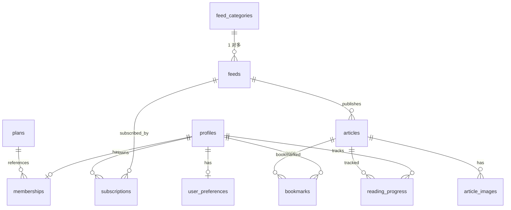

# 数据库设计（OneRss）

## 1. 目标与范围

本文档定义 OneRss 的 Supabase Postgres 数据模型、关系约束、索引与 RLS（Row-Level Security）策略。  
本设计用于支撑 `docs/spec/requirements.md` 与 `docs/spec/design.md` 的已确认需求。

## 2. 设计原则

- 用户私有数据严格按 `auth.uid()` 隔离。
- 目录与文章属于平台数据，登录用户可读，写入受服务端控制。
- 会员能力由服务端数据判定，前端仅做展示与预校验。
- 所有时间字段统一使用 `timestamptz`（UTC）。
- 主键统一使用 `uuid`，并启用默认生成。

## 3. 实体关系总览



## 4. 数据表设计

> 说明：`auth.users` 为 Supabase 内置用户表，业务表以其 `id` 作为外键。

### 4.1 `profiles`（用户资料）

- 用途：扩展用户基础信息与状态。
- 关键字段：
  - `id uuid pk`（= `auth.users.id`）
  - `display_name text`
  - `avatar_url text`
  - `role text`（`user` / `admin`）
  - `created_at timestamptz`
  - `updated_at timestamptz`

### 4.1.1 `email_otp_challenges`（邮箱注册 OTP）

- 用途：注册流程中的邮箱 OTP 挑战记录；仅存验证码哈希与过期时间，明文验证码仅通过邮件触达用户。
- 关键字段：
  - `id uuid pk`
  - `email text not null`（小写规范化邮箱）
  - `code_hash text not null`（`SHA-256(email:code:OTP_PEPPER)` 十六进制）
  - `expires_at timestamptz not null`
  - `consumed_at timestamptz`（校验成功后由后续流程写入，任务 5）
  - `created_at timestamptz`
- 访问控制：启用 RLS；不授予 `anon` / `authenticated` 策略；仅服务端 service role（Edge Function 等）可读写。
- 清理：过期数据可由定时任务归档/删除（可延后）。

### 4.2 `plans`（会员套餐）

- 用途：定义月付/年付套餐。
- 关键字段：
  - `id uuid pk`
  - `code text unique`（`monthly` / `yearly`）
  - `name text`
  - `billing_cycle text`（`month` / `year`）
  - `price_cents integer`
  - `currency text`
  - `is_active boolean`
  - `created_at timestamptz`

### 4.3 `memberships`（用户会员状态）

- 用途：记录会员等级与有效期。
- 关键字段：
  - `id uuid pk`
  - `user_id uuid fk -> profiles.id unique`
  - `plan_id uuid fk -> plans.id`
  - `tier text`（`free` / `premium`）
  - `status text`（`active` / `expired` / `canceled` / `pending`）
  - `started_at timestamptz`
  - `expires_at timestamptz`
  - `updated_at timestamptz`

### 4.4 `feed_categories`（订阅源分类）

- 用途：管理订阅源分类目录，一个分类可包含多个订阅源（一对多关系）。
- 关键字段：
  - `id uuid pk`
  - `title text`（分类名称）
  - `slug text unique`（URL 友好标识）
  - `sort integer`（排序权重，数值越小越靠前）
  - `created_at timestamptz`
  - `updated_at timestamptz`

### 4.5 `feeds`（订阅源数据）

- 用途：公开 RSS 源数据与展示优先级配置（归属分类，一对多关系）。
- 关键字段：
  - `id uuid pk`
  - `category_id uuid fk -> feed_categories.id`（所属分类的外键）
  - `title text`（源名称）
  - `url text unique`（RSS 订阅地址）
  - `image_url text`（源图标/封面图）
  - `site_url text`（源网站地址）
  - `language text`
  - `is_featured boolean default false`（精品栏目标记，`true` 时内容在列表中优先展示）
  - `created_at timestamptz`
  - `updated_at timestamptz`

### 4.6 `subscriptions`（用户订阅关系）

- 用途：用户与源的订阅映射。
- 关键字段：
  - `id uuid pk`
  - `user_id uuid fk -> profiles.id`
  - `feed_id uuid fk -> feeds.id`
  - `is_muted boolean`
  - `created_at timestamptz`
  - `updated_at timestamptz`
- 约束：
  - `unique(user_id, feed_id)` 防止重复订阅。

### 4.7 `articles`（文章主表）

- 用途：聚合后的文章内容与时间排序基准。
- 关键字段：
  - `id uuid pk`
  - `feed_id uuid fk -> feeds.id`
  - `title text`
  - `author text`
  - `summary text`
  - `content text`
  - `source_url text unique`
  - `published_at timestamptz`
  - `read_time_minutes integer`
  - `created_at timestamptz`

### 4.8 `article_images`（文章图片）

- 用途：离线缓存与阅读渲染所需图片索引。
- 关键字段：
  - `id uuid pk`
  - `article_id uuid fk -> articles.id`
  - `image_url text`
  - `sort integer`
  - `created_at timestamptz`

### 4.9 `bookmarks`（用户收藏）

- 用途：文章收藏状态。
- 关键字段：
  - `id uuid pk`
  - `user_id uuid fk -> profiles.id`
  - `article_id uuid fk -> articles.id`
  - `created_at timestamptz`
- 约束：
  - `unique(user_id, article_id)`

### 4.10 `reading_progress`（阅读进度）

- 用途：记录用户阅读进度与最后阅读时间。
- 关键字段：
  - `id uuid pk`
  - `user_id uuid fk -> profiles.id`
  - `article_id uuid fk -> articles.id`
  - `progress_percent numeric(5,2)`（0-100）
  - `last_position text`（可存段落锚点）
  - `updated_at timestamptz`
- 约束：
  - `unique(user_id, article_id)`

### 4.11 `user_preferences`（用户偏好）

- 用途：主题、字体、翻译语言等个性化设置。
- 关键字段：
  - `id uuid pk`
  - `user_id uuid fk -> profiles.id unique`
  - `theme text`（`light` / `dark` / `deep`）
  - `font_scale numeric(4,2)`
  - `line_height numeric(4,2)`
  - `ui_language text`
  - `translate_language text`
  - `updated_at timestamptz`

## 5. 关键业务约束（数据库层）

1. 普通用户订阅上限 10：通过触发器在 `subscriptions` 插入时校验 `memberships.tier`。
2. 高级能力（翻译/朗读）依赖会员状态：由应用层 + 接口层校验 `memberships`。
3. 内容流优先级：关联 `feeds.is_featured = true` 的数据源内容优先展示。
4. 同优先级内排序：按 `articles.published_at desc`（最新在前）。
5. 账号唯一归属：所有私有表均必须含 `user_id` 并受 RLS 保护。

## 6. 索引设计

- `subscriptions(user_id)`、`subscriptions(feed_id)`、`subscriptions(user_id, feed_id unique)`
- `feeds(category_id, is_featured, created_at desc)`
- `articles(feed_id, published_at desc)`
- `articles(published_at desc)`
- `bookmarks(user_id, created_at desc)`
- `reading_progress(user_id, updated_at desc)`
- `feed_categories(sort, created_at desc)`

## 7. RLS 策略（核心）

## 7.1 启用 RLS

对以下表启用 RLS：

- `profiles`
- `memberships`
- `subscriptions`
- `bookmarks`
- `reading_progress`
- `user_preferences`
- `feeds`
- `feed_categories`
- `articles`
- `article_images`
- `plans`

## 7.2 策略原则

- 用户私有表：仅允许 `auth.uid() = user_id` 访问。
- 公共内容表（`feed_categories` / `feeds` / `articles` / `article_images`）：登录用户可 SELECT，写操作仅 service role。
- 套餐表 `plans`：登录用户可 SELECT，写操作仅 admin/service。
- 未显式放开的操作默认拒绝：启用 RLS 后，未配置策略的写操作（INSERT/UPDATE/DELETE）一律不允许。

## 7.3 SQL 策略草案

```sql
-- profiles
alter table public.profiles enable row level security;
create policy "profiles_select_own" on public.profiles
for select using (auth.uid() = id);
create policy "profiles_update_own" on public.profiles
for update using (auth.uid() = id) with check (auth.uid() = id);
create policy "profiles_insert_own" on public.profiles
for insert with check (auth.uid() = id);

-- memberships
alter table public.memberships enable row level security;
create policy "memberships_select_own" on public.memberships
for select using (auth.uid() = user_id);

-- subscriptions
alter table public.subscriptions enable row level security;
create policy "subscriptions_select_own" on public.subscriptions
for select using (auth.uid() = user_id);
create policy "subscriptions_insert_own" on public.subscriptions
for insert with check (auth.uid() = user_id);
create policy "subscriptions_update_own" on public.subscriptions
for update using (auth.uid() = user_id) with check (auth.uid() = user_id);
create policy "subscriptions_delete_own" on public.subscriptions
for delete using (auth.uid() = user_id);

-- bookmarks
alter table public.bookmarks enable row level security;
create policy "bookmarks_select_own" on public.bookmarks
for select using (auth.uid() = user_id);
create policy "bookmarks_insert_own" on public.bookmarks
for insert with check (auth.uid() = user_id);
create policy "bookmarks_delete_own" on public.bookmarks
for delete using (auth.uid() = user_id);

-- reading_progress
alter table public.reading_progress enable row level security;
create policy "reading_progress_select_own" on public.reading_progress
for select using (auth.uid() = user_id);
create policy "reading_progress_insert_own" on public.reading_progress
for insert with check (auth.uid() = user_id);
create policy "reading_progress_update_own" on public.reading_progress
for update using (auth.uid() = user_id) with check (auth.uid() = user_id);

-- user_preferences
alter table public.user_preferences enable row level security;
create policy "user_preferences_select_own" on public.user_preferences
for select using (auth.uid() = user_id);
create policy "user_preferences_upsert_own" on public.user_preferences
for all using (auth.uid() = user_id) with check (auth.uid() = user_id);

-- public readable tables for authenticated users
alter table public.feed_categories enable row level security;
create policy "feed_categories_select_auth" on public.feed_categories
for select using (auth.uid() is not null);

alter table public.feeds enable row level security;
create policy "feeds_select_auth" on public.feeds
for select using (auth.uid() is not null);

alter table public.articles enable row level security;
create policy "articles_select_auth" on public.articles
for select using (auth.uid() is not null);

alter table public.article_images enable row level security;
create policy "article_images_select_auth" on public.article_images
for select using (auth.uid() is not null);

alter table public.plans enable row level security;
create policy "plans_select_auth" on public.plans
for select using (auth.uid() is not null);
```

> 可执行迁移脚本：`docs/spec/sql/001_rls_policies.sql`（包含 `drop policy if exists`，可重复执行）。

## 8. 订阅上限约束（触发器草案）

```sql
create or replace function public.check_subscription_limit()
returns trigger
language plpgsql
as $$
declare
  user_tier text;
  sub_count integer;
begin
  select coalesce(m.tier, 'free') into user_tier
  from public.memberships m
  where m.user_id = new.user_id
  limit 1;

  if user_tier <> 'premium' then
    select count(*) into sub_count
    from public.subscriptions s
    where s.user_id = new.user_id;

    if sub_count >= 10 then
      raise exception 'Subscription limit reached for free user';
    end if;
  end if;

  return new;
end;
$$;

drop trigger if exists trg_check_subscription_limit on public.subscriptions;
create trigger trg_check_subscription_limit
before insert on public.subscriptions
for each row execute function public.check_subscription_limit();
```

## 9. 数据迁移与初始化建议

- 使用版本化 SQL migration 管理 schema 变更。
- 初始化数据：
  - `plans`：月付、年付两条记录。
  - `feed_categories`：初始化默认分类（科技/设计/商业等）及排序。
  - `feeds`：导入首批公开目录源并绑定 `category_id`，按需要设置 `is_featured`。
- 为历史文章补全 `published_at`、`read_time_minutes` 默认值策略。

## 10. 待实现说明

- 支付回调与会员状态同步涉及外部支付网关，建议通过 Edge Functions 承接。
- 第三方登录账户合并流程与审计日志建议新增 `account_links` 与 `audit_logs`（如后续审计要求增强可扩展）。
