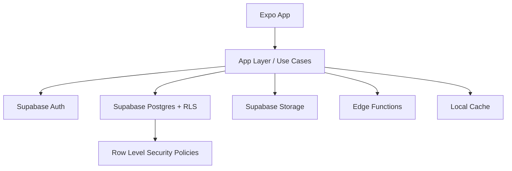

# 技术方案设计（OneRss）

## 1. 文档目标与范围
本文档用于定义 OneRss 在当前阶段的技术实现方案，基于已确认需求文档 `docs/spec/requirements.md` 与项目宪法 `docs/spec/constitution.md`。  
本文件聚焦技术架构与实现策略，不重复数据库与接口细节：
- 数据库设计：见 `docs/spec/data.md`
- 接口设计：见 `docs/spec/api.md`

## 2. 技术栈与选型结论

### 2.1 核心技术栈
- 客户端框架：`Expo`（React Native）
- 后端能力：`Supabase`（Auth / Postgres / RLS / Storage / Edge Functions）
- 样式系统：`NativeWind`（Tailwind 风格原子类）
- 语言：`TypeScript`

### 2.2 选型原则
- **一致性优先**：技术选型必须兼容现有架构，不引入平行技术路线。
- **可维护性优先**：优先选择社区成熟、文档完善、可测试方案。
- **安全默认开启**：以 Supabase 鉴权与 RLS 作为默认数据访问边界。
- **跨端体验一致**：UI 组件、状态管理、错误语义在 iOS/Android 保持一致。

## 3. 系统架构设计

### 3.1 分层架构
- **表现层（UI）**：页面、组件、样式（NativeWind）
- **应用层（Use Cases）**：业务编排（登录、订阅、阅读、会员、离线）
- **领域层（Domain）**：实体与规则（用户、会员、订阅、文章、阅读偏好）
- **基础设施层（Infra）**：Supabase 客户端、缓存存储、网络、日志、监控

### 3.2 运行时拓扑



### 3.3 项目结构（建议）

```text
src/
  app/                 # Expo Router 页面入口（按路由分组）
  modules/
    auth/
    subscription/
    feed/
    reader/
    membership/
    profile/
  components/          # 通用 UI 组件（无业务副作用）
  services/            # supabase client、storage、logger、analytics
  stores/              # 状态管理（session、settings、feature state）
  hooks/               # 复用 hooks
  utils/               # 工具函数（纯函数）
  config/              # 常量与配置集中管理
  types/               # 全局类型与领域类型
  test/                # 测试辅助与 mock
```

## 4. 需求到模块映射

- 需求 1（登录）→ `modules/auth`
- 需求 2（发现订阅）→ `modules/subscription`
- 需求 3（今日聚合）→ `modules/feed`
- 需求 4（书架管理）→ `modules/subscription` + `modules/feed`
- 需求 5（阅读体验）→ `modules/reader`
- 需求 6（个人设置）→ `modules/profile`
- 需求 7（会员计费）→ `modules/membership`
- 需求 8（导航）→ `app/` 路由与导航壳层
- 需求 9（非功能与离线）→ `services/` + 各模块协同

## 5. 关键技术方案

### 5.1 登录与会话
- 统一由 Supabase Auth 承担身份认证（邮箱验证码注册 + 邮箱密码登录 + 第三方登录）。
- 会话状态由应用层集中管理，路由守卫统一处理“未登录拦截”。
- 首次启动默认进入认证流程，认证成功后进入主导航壳。
- 注册流程采用两段式：发送验证码并校验通过后，再提交密码完成注册；登录流程使用邮箱 + 密码凭证。

### 5.2 会员能力与权限开关
- 会员等级在会话上下文中作为能力标识（普通/高级）。
- 功能门禁在应用层统一判定：
  - 普通：订阅上限 10，禁止朗读/翻译
  - 高级：解锁朗读/翻译、订阅数量不设产品上限
- UI 与接口调用均执行同源校验，防止仅前端限制导致绕过。

### 5.3 内容流与排序
- 今日页默认按发布时间倒序。
- 精选栏目展示“精选订阅栏目”下的文章，并按发布时间倒序（最新在前）。
- 排序规则在应用层做单一实现，避免多处不一致。

### 5.4 离线缓存策略
- 触发时机：用户打开文章详情即缓存。
- 缓存内容：正文 + 图片 + 基本元数据。
- 离线模式：仅允许读取缓存内容，写操作（收藏/订阅/偏好更新）统一阻断并提示联网重试。
- 缓存组件与阅读模块解耦，便于后续替换与扩展。

### 5.5 UI 与主题体系
- NativeWind 承担样式表达，设计令牌统一映射到主题变量。
- 页面组件分为“容器组件（含业务）”与“展示组件（纯 UI）”。
- 深浅主题、字体大小、阅读偏好通过统一设置仓库持久化。

## 6. 数据与接口引用（不展开）
- 数据模型、关系、索引、RLS 策略：见 `docs/spec/data.md`
- 接口契约、错误码、幂等、分页与鉴权规范：见 `docs/spec/api.md`

## 7. 测试策略

### 7.1 测试分层
- 单元测试：领域规则、工具函数、能力门禁判定
- 集成测试：模块用例（登录、订阅、阅读、会员、离线）
- 端到端测试：关键路径（注册登录 → 订阅 → 阅读 → 会员升级）
- 视觉回归：关键页面（今日、发现、书架、阅读、我的）

### 7.2 TDD 执行要求
- 所有 P0 功能遵循 Red → Green → Refactor。
- 每个需求条目至少对应 1 条自动化验收用例。
- 发布前必须完成关键路径回归（登录、订阅、阅读、离线、会员）。

## 8. 安全与隐私设计
- 默认鉴权：业务接口默认要求用户身份。
- 数据隔离：依赖 RLS 保证用户仅访问本人数据。
- 敏感信息保护：密钥通过环境变量注入，禁止硬编码。
- 日志脱敏：禁止输出验证码、令牌、用户敏感信息。
- 权限双重校验：前端门禁 + 后端鉴权并行。

## 9. 性能与可访问性落地
- 性能目标遵循需求定稿：
  - 今日页首屏可见内容 2 秒内（4G 或更优）
  - 核心列表滚动不低于 45 FPS（Wi-Fi）
- 可访问性目标：
  - 支持系统动态字体至 200%
  - 关键控件具备读屏可识别名称
  - 文本对比度满足 WCAG AA

## 10. 技术风险与应对
- 第三方登录兼容性差异：通过统一 auth 适配层隔离平台差异。
- 离线缓存占用增长：引入缓存配额与淘汰策略（具体见数据/缓存策略文档）。
- 富媒体阅读性能波动：列表与图片加载采用分层懒加载策略。
- 会员状态一致性：以服务端状态为准，客户端只做展示与预校验。

## 11. 里程碑建议（实现顺序）
1. M1：认证与导航壳（需求 1、8）
2. M2：发现订阅与书架（需求 2、4）
3. M3：今日流与阅读基础（需求 3、5 基础）
4. M4：会员计费与能力门禁（需求 7 + 需求 5 高级能力）
5. M5：离线与非功能打磨（需求 9）

## 12. 确认结论
以下内容已确认并生效：
1. 接受本方案中的分层架构与目录结构，作为实施基线。  
2. 同意里程碑顺序按 `M1 -> M5` 推进。  
3. `docs/spec/data.md` 与 `docs/spec/api.md` 作为数据库与接口细节唯一来源，`design.md` 仅保留引用不重复展开。
